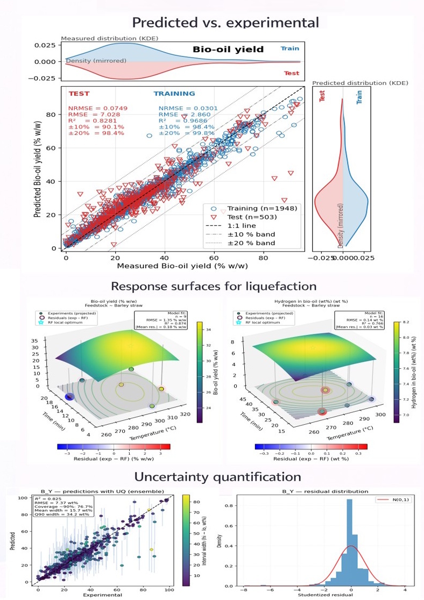

# ML-UQ Hydrothermal Pipeline

## Biomass HTT/HTL Dataset
DOI: https://doi.org/10.22000/0b7ffmw1jtca3gw3

## Machine Learning with Uncertainty Quantification for Hydrothermal Processing

Hey there! This repository is your complete toolkit for training machine learning models on hydrothermal processing data with proper uncertainty quantification. We're talking Random Forest models with conformal prediction for predicting biochar, bio-oil, and hydrochar properties - basically everything you need to turn experimental data into reliable predictions.

## What's Inside?

- **Smart Data Processing**: Feature engineering with interactions, one-hot encoding, and normalization (handles DAF/dry basis conversions too)
- **ML Models**: Random Forest regression with cross-validation and hyperparameter tuning
- **Uncertainty Quantification**: Conformal prediction intervals that give you honest confidence bounds
- **Response Surface Analysis**: 3D visualization of how process conditions affect your targets
- **Model Persistence**: Save/load trained models and their parameters
- **Rich Visualizations**: Parity plots, feature importance, UQ diagnostics, and interactive 3D surfaces
- **Quality Assurance**: Built-in data validation and physics-based constraints

## Repository Structure

```
ml_uq_hydrothermal_pipeline/
├── notebooks/                      # Analysis notebooks
│   ├── hydrothermal_ml_pipeline.ipynb      # Main training pipeline
│   ├── results_analysis.ipynb              # Results + UQ diagnostics
│   ├── response_surface_reconstruction.ipynb   # 3D RSM visualization
│   └── data_exploration.ipynb              # Data stats and exploration
│
├── src/                            # Core modules
│   ├── data_preparation.py         # Feature engineering pipeline
│   ├── rf_trainers.py              # Random Forest training + conformal prediction
│   ├── rsm_analysis.py             # Response surface methodology
│   ├── ratio_functions.py          # Atomic ratio calculations
│   ├── qa_envelopes.py             # Data quality checks
│   ├── physics_postprocess.py      # Physics-based constraints
│   ├── plot_db_overview.py         # Database visualization
│   ├── interaction_features.py     # Feature interaction utilities
│   └── normalize_daf_to_dry_basis.py   # Basis conversions
│
├── data/                           # The ML-ready dataset
│   └── HTT_normalized_data_catalysts.csv
│
├── models/                         # Trained models
│   └── saved_models_global_with_tier_subprocess_catalyst_lri/
│
├── outputs/                        # Results and figures
│   ├── conformal/                  # UQ prediction intervals
│   ├── figures/                    # All your beautiful plots
│   └── tables/                     # CSV results
│
├── requirements.txt                # Python dependencies
└── setup.py                        # Package setup
```

## Installation

### 1. Clone the repository

```bash
git clone <repo-url>
cd ml_uq_hydrothermal_pipeline
```

### 2. Create a virtual environment (recommended)

```bash
python -m venv venv
source venv/bin/activate  # On Windows: venv\Scripts\activate
```

### 3. Install dependencies

```bash
pip install -r requirements.txt
```

Or instGet Your Data Ready

Drop your hydrothermal processing dataset in the `data/` directory. We need:
- Feedstock composition (C, H, O, N, S, Ash)
- Process conditions (Temperature, time, catalyst, solvent)
- Product properties (yields, composition, HHV, etc.)

Check out `data/README.md` for the exact format we're expecting.

### 2. Fire Up the Notebooks

```bash
jupyter notebook
```

Then navigate to `notebooks/` and start with:

1. **hydrothermal_ml_pipeline.ipynb** - Train your models here (24 targets!)
2. **results_analysis.ipynb** - Analyze performance and check UQ quality
3. **response_surface_reconstruction.ipynb** - Explore how T and time affect your targets

### 3. What Each Notebook Does

**Training Pipeline:**
- Loads and cleans your data
- Engineers features (including interactions and lignocellulosic ratios)
- Splits data intelligently (random, by DOI, or by feedstock)
- Trains Random Forest models with cross-validation
- Computes conformal prediction intervals
- Saves everything for later

**Results Analysis:**
Tweak these in the training notebook to match your needs:

```python
# Feature engineering
USE_INTERACTIONS = True      # Add interaction features (T×C, t×C, etc.)
USE_TIER = True             # Include process tier (HTC vs HTL)
USE_LIGNO_RATIOS = True     # Add lignocellulosic ratios (LRI, CeRI, HeRI)

# Model settings
N_ESTIMATORS = 100          # Number of trees (more = slower but better)
DO_GRID_SEARCH = False      # Set True for hyperparameter tuning

# Uncertainty quantification
ALPHA = 0.10                # 90% prediction intervals (1-alpha)

# Data splitting
TEST_FRACTION = 0.2         # 20% held out for testing
SPLIT_MODE = "random"       # Options: "random", "by_doi", "by_feedstock"

# Paths (auto-detected from notebook location)
DATA_DIR = project_root / "data"
MODELS_DIR = project_root / "models"
OUTPUTS_DIR = project_root / "outputs
- Model training with cross-validation
- Uncertainty quantification
- Results visualization

## Key Configuration

Edit these parameters in the notebook:

```python
# Model settings
USE_INTERACTIONS = True      # Enable feature interactions
USE_TIER = True             # Use hierarchical features
ALPHA = 0.10                # Significance level (90% confidence)

# Train/test split
TEST_FRACTION = 0.2         # 20% test set
SPLIT_MODE = "random"       # or "by_doi", "by_feedstock"
Using the Code

### Training Models

We train 24 different targets in one go (yields, compositions, energy content, atomic ratios):

```python
from src.rf_trainers import train_rf_models

results = train_rf_models(
    X_train, Y_train, X_test, Y_test,
    use_best_params=True,        # Use pre-tuned hyperparameters
    do_grid_search=False,        # Set True for fresh tuning
    n_estimators=100,
    random_state=42
)
```

### Response Surface Analysis

We use conformal prediction - it's distribution-free and gives you honest coverage:

```python
from src.rf_trainers import conformal_predict

y_pred_mean, y_pred_lo, y_pred_hi = conformal_predict(
    rf_model, X_cal, y_cal, X_test, alpha=0.10
)
# Now you have 90% prediction intervals that actually work!
```

The cool thing? Unlike traditional methods, conformal prediction:
- Makes no assumptions about your data distribution
- Guarantees the coverage rate you ask for
- Works with any base model (RF, neural nets, whatever)
- Adjusts interval width based on prediction difficulty models=rf_models,
    x_col="T", y_col="t",              # Temperature vs time
   What You Get

After running the pipeline, check out:

**Saved Models** (`models/saved_models_global_.../`)
- `rf_B_Y.joblib`, `rf_C_Y.joblib`, etc. - All 24 trained models
- `lr_*.joblib` - Linear regression baselines for comparison

**Results Tables** (`outputs/tables/`)
- `results_cv.csv` - Cross-validation metrics (R², RMSE, coverage)
- `X_train.csv`, `Y_train.csv` - Your training data
- `X_test.csv`, `Y_test.csv` - Test set for evaluation

**Figures** (`outputs/figures/`)
- Parity plots with prediction intervals
- Feature importance rankings
- UQ diagnostic plots (QQ, residuals, calibration)
- Error distributions by feedstock family
- 3D response surfaces

**Conformal Outputs** (`outputs/conformal/`)
- Prediction intervals for each target
- Coverage statistics
- Calibration metrics
    use_best_params=True,
    do_grid_search=False
)
```

You'll need Python 3.8 or newer, plus these key packages:

- **scikit-learn** (>= 1.0) - The ML workhorse
- **pandas** (>= 1.3) - Data wrangling
- **numpy** (>= 1.21) - Numerical computing
- **matplotlib** (>= 3.4) - 2D plotting
- **scipy** (>= 1.7) - Stats and optimization
- **joblib** (>= 1.0) - Model serialization

The full list is in `requirements.txt` - just run `pip install -r requirements.txt` and you're good to go!
```
ool Features You Might Miss

### Data Quality Checks
The `qa_envelopes.py` module validates your data against physical constraints (e.g., elemental mass balance, HHV ranges) before training. No more garbage in, garbage out!

### Physics-Based Post-Processing
`physics_postprocess.py` ensures your predictions respect conservation laws. If your model predicts 110% carbon yield, we'll gently remind it that's impossible.

### Lignocellulosic Ratios
We compute LRI (lignin richness), CeRI (cellulose), and HeRI (hemicellulose) indices automatically - super useful for woody biomass characterization.

### Smart Feature Engineering
The pipeline handles:
- Interaction terms (T×C, t×O/C, etc.)
- One-hot encoding (catalyst type, solvent, subprocess)
- Basis conversions (DAF to dry basis)
- Missing value imputation

### Flexible Data Splitting
Split your data three ways:
- **Random** - Standard train/test split
- **By DOI** - Hold out entire studies (tests generalization across papers)
- **By Feedstock** - Hold out feedstock types (tests generalization to new biomass)

## Tips and Tricks

1. **Start small**: Run `data_exploration.ipynb` first to understand your dataset
2. **Check UQ quality**: Always look at the calibration plots in `results_analysis.ipynb`
3. **Don't over-extrapolate**: Use `extrapolation_absolute` in RSM to stay near your data
4. **Save everything**: Models are saved automatically - reuse them instead of retraining!
5. **Use interactions**: They help capture synergistic effects between variables

## Common Issues

**"Feature names mismatch"** - Make sure you're using the same feature engineering pipeline for training and prediction. The notebooks handle this automatically.

**"Coverage is too low"** - Check your calibration set size. You need at least 50-100 points for conformal prediction to work well.

**"RSM plots look weird"** - You might be extrapolating too far. Reduce the extrapolation factors or check if you have enough data points in that region.

## License

MIT License - do whatever you want with this code, just give credit where it's due!

## Contributing

Found a bug? Have a cool feature idea? Pull requests are welcome! This is academic code, so it's not perfect, but we're always improving.

## Citation

If this helps your research, a citation would be awesome:

```
[Citation coming soon - paper in prep]
```


**Questions?** Open an issue on GitHub - we're happy to help!
## License

This project is licensed under the MIT License - see the [LICENSE](LICENSE) file for details.

## Contributing

Contributions are welcome! Please feel free to submit a Pull Request.


## Flowchart



# MachineLearning_UncertaintyAware_Hydrothermal_Pipeline


